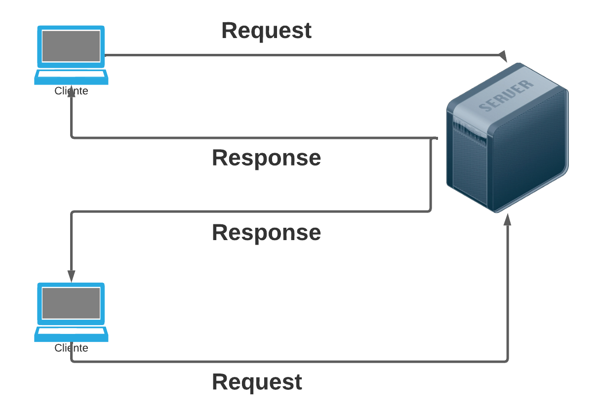
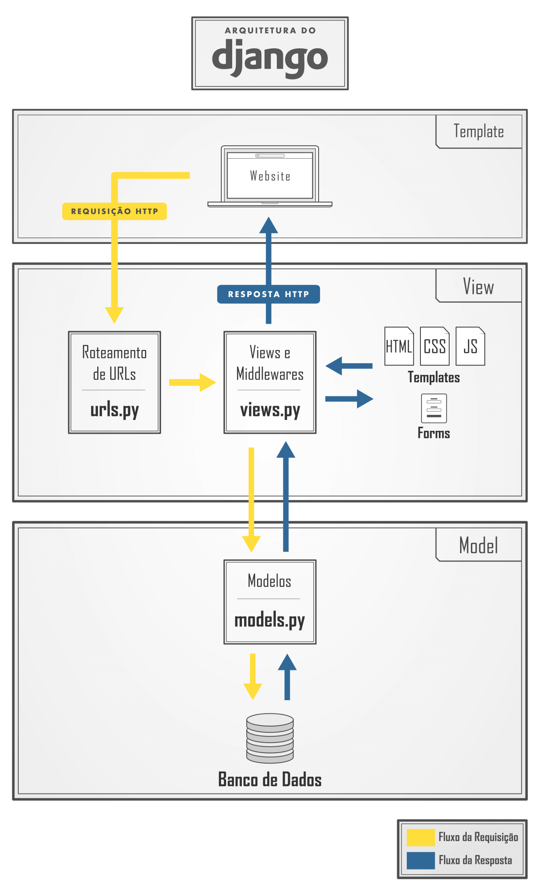

# AULA 1 | PSW - O RETORNO

## Conceitos

Cliente servidor:



Fluxo de dados no Django:



## A aplicação

## Configurações iniciais

Primeiro devemos criar o ambiente virtual:

```python
# Criar
	# Linux
		python3 -m venv venv
	# Windows
		python -m venv venv
```

Após a criação do venv vamos ativa-lo:

```python
#Ativar
	# Linux
		source venv/bin/activate
	# Windows
		venv\Scripts\Activate

# Caso algum comando retorne um erro de permissão execute o código e tente novamente:

Set-ExecutionPolicy -Scope CurrentUser -ExecutionPolicy RemoteSigned
```

Agora vamos fazer a instalação do Django e as demais bibliotecas:

```python
pip install django
pip install pillow
```

Vamos criar o nosso projeto em Django:

```python
django-admin startproject adote .
```

Crie um novo app:

```python
python manage.py startapp usuarios
```

Crie uma URL para o app usuários:

```python
path('auth/', include('usuarios.urls')),
```

## Cadastro

Crie uma URL para realizar o cadastro de usuários:

```python
from django.urls import path
from . import views

urlpatterns = [
    path('cadastro/', views.cadastro, name="cadastro"),
]
```

Crie a função cadastro:

```python
def cadastro(request):
    if request.method == "GET":
        return render(request, 'cadastro.html')
```

Configure onde o Django irá procurar os arquivos html:

```python
os.path.join(BASE_DIR, 'templates')
```

Crie o arquivo cadastro.html

```python
<!doctype html>
<html lang="pt-BR">
    <head>
    <meta charset="utf-8">
    <meta name="viewport" content="width=device-width, initial-scale=1">
    <title>Cadastro</title>
    <link href="https://cdn.jsdelivr.net/npm/bootstrap@5.3.0-alpha1/dist/css/bootstrap.min.css" rel="stylesheet">

    </head>
    <body>

        <div class="container-fluid">
            <div class="row">
                <div class="col-md-5 bg-side">
                    <div class='header'>
                        <span class="font-logo">ADO.TE</span>
                    </div>

                    <div class="body-form">
                        <h2>Cadastre-se</h2>
                        <p>Seu cadastro salva vidas.</p>
                        <hr>
                        <form action="" method="POST">
                            <span>Nome:</span>
                            <input type="text" class="form-control" placeholder="Digite seu nome..." name="nome">
                            <br>
                            <span>E-mail:</span>
                            <input type="email" class="form-control" placeholder="Digite seu email..." name="email">
                            <br>
                            <div class="row">

                                <div class="col-md">
                                    <span>Senha:</span>
                                    <input type="password" class="form-control" placeholder="Digite sua senha..." name="senha">
                                </div>

                                <div class="col-md">
                                    <span>Confirmar senha:</span>
                                    <input type="password" class="form-control" placeholder="Digite sua senha..." name="confirmar_senha">
                                </div>
                            </div>

                            <input type="submit" value="SALVAR" class="btn-custom-primary">
                        
                            <a href="" class="link-float">Já tenho uma conta</a>
                        </form>
                    </div>
                </div>

                <div class="col-md-7">
                    <div class="side-logo">
                        
                        <h1>ADO.TE</h1>
                        <p>Nos ajude a salvar vidas.</p>
                    </div>
                </div>

            </div>

        </div>

    
    <script src="https://cdn.jsdelivr.net/npm/bootstrap@5.3.0-alpha1/dist/js/bootstrap.bundle.min.js"></script>
    </body>
</html>
```

Configure os arquivos estáticos:

```python
STATIC_URL = '/static/'
STATICFILES_DIRS = (os.path.join(BASE_DIR, 'templates/static'),)
STATIC_ROOT = os.path.join('static')

MEDIA_ROOT = os.path.join(BASE_DIR, 'media')
MEDIA_URL = '/media/'
```

Crie o arquivos cadastro.css

```python
.bg-side{
    background-color: #391D34;
    color: white;
    height: 100vh;
    

}
.header{
    border-bottom: 1px solid white;
    padding: 20px;
}

.body-form{
    padding: 20px;
}

.font-logo{
    margin-left: 10px;
    font-size: 40px;
    
}

.btn-custom-primary{
    background-color: #3D7B80;
    border: none;
    box-shadow: 2px 2px 5px 1px black;
    color: white;
    font-size: 20px;
    padding: 5px 20px 5px 20px;
    border-radius: 10px;
    margin-top: 20px;

}

.link-float{

    text-decoration: none;
    float: right;
    margin: 20px;
}

.side-logo{
    text-align: center;
    margin-top: 60px;    
}
```

No html carregue os estáticos:

```python

```

Importe o CSS:

```python
<link href="" rel="stylesheet">
```

Carregue a logo:

```python

```

Envie os dados do formulário para a view cadastro:

```python
<form action="" method="POST">
```

Crie a view cadastro completa:

```python
from django.contrib.auth.models import User

def cadastro(request):
    if request.method == "GET":
        return render(request, 'cadastro.html')
    elif request.method == "POST":
        nome = request.POST.get('nome')
        email = request.POST.get('email')
        senha = request.POST.get('senha')
        confirmar_senha = request.POST.get('confirmar_senha')

        if len(nome.strip()) == 0 or len(email.strip()) == 0 or len(senha.strip()) == 0 or len(confirmar_senha.strip()) == 0:
            return render(request, 'cadastro.html')
        
        if senha != confirmar_senha:
            return render(request, 'cadastro.html')

        try:
            user = User.objects.create_user(
                username=nome,
                email=email,
                password=senha,
            )
            return render(request, 'cadastro.html')
        except:
            return render(request, 'cadastro.html')
```

Configure as messages:

```python
from django.contrib.messages import constants

MESSAGE_TAGS = {
    constants.DEBUG: 'alert-primary',
    constants.ERROR: 'alert-danger',
    constants.SUCCESS: 'alert-success',
    constants.INFO: 'alert-info',
    constants.WARNING: 'alert-warning',
}
```

Adicione as mensagens na view cadastro:

```python
from django.contrib import messages
from django.contrib.messages import constants

messages.add_message(request, constants.ERROR, 'Sua mensagem aqui.')
```

Exiba as mensagens no HTML:

```python

    <br>
    
        <div class="alert {{message.tags}}">
            {{message}}
        </div>
    

```

## Login

Crie a URL para o login:

```python
path('login/', views.logar, name="login"),
```

Crie a view logar:

```python
def logar(request):
    if request.method == "GET":
        return render(request, 'login.html')
```

```python

<!doctype html>
<html lang="pt-BR">
    <head>
    <meta charset="utf-8">
    <meta name="viewport" content="width=device-width, initial-scale=1">
    <title>Cadastro</title>
    <link href="https://cdn.jsdelivr.net/npm/bootstrap@5.3.0-alpha1/dist/css/bootstrap.min.css" rel="stylesheet">
    <link href="" rel="stylesheet">

    </head>
    <body>

        <div class="container-fluid">
            <div class="row">
                <div class="col-md-5 bg-side">
                    <div class='header'>
                        <span class="font-logo">ADO.TE</span>
                    </div>

                    <div class="body-form">
                        
                            <br>
                            
                                <div class="alert {{message.tags}}">
                                    {{message}}
                                </div>
                            
                        
                        <h2>Logar</h2>
                        <p>Que bom ter você de volta.</p>
                        <hr>
                        <form action="" method="POST">
                            <span>Nome:</span>
                            <input type="text" class="form-control" placeholder="Digite seu nome..." name="nome">
                            <br>
                           
                            <span>Senha:</span>
                            <input type="password" class="form-control" placeholder="Digite sua senha..." name="senha">
                                

                            <input type="submit" value="SALVAR" class="btn-custom-primary">
                        
                            <a href="" class="link-float">Cadastre-se</a>
                        </form>
                    </div>
                </div>

                <div class="col-md-7">
                    <div class="side-logo">
                        
                        <h1>ADO.TE</h1>
                        <p>Nos ajude a salvar vidas.</p>
                    </div>
                </div>

            </div>

        </div>

    
    <script src="https://cdn.jsdelivr.net/npm/bootstrap@5.3.0-alpha1/dist/js/bootstrap.bundle.min.js"></script>
    </body>
</html>
```

Redirecione os dados do formulário para a view logar:

```python
<form action="" method="POST">
```

Programe o login de usuários:

```python
from django.contrib.auth import authenticate, login, logout

elif request.method == "POST":
  nome = request.POST.get('nome')
  senha = request.POST.get('senha')
  user = authenticate(username=nome,
                      password=senha)

  if user is not None:
      login(request, user)
      return redirect('/divulgar/novo_pet')
  else:
      messages.add_message(request, constants.ERROR, 'Usuário ou senha inválidos')
      return render(request, 'login.html')
```

## Logout

Crie a url para deslogar da aplicação:

```python
path('sair/', views.sair, name="sair")
```

Crie a view sair:

```python
def sair(request):
    logout(request)
    return redirect('/auth/login')
```

Valide se o usuário já está logado:

```python
if request.user.is_authenticated:
        return redirect('/divulgar/novo_pet')
```

## Imagens

